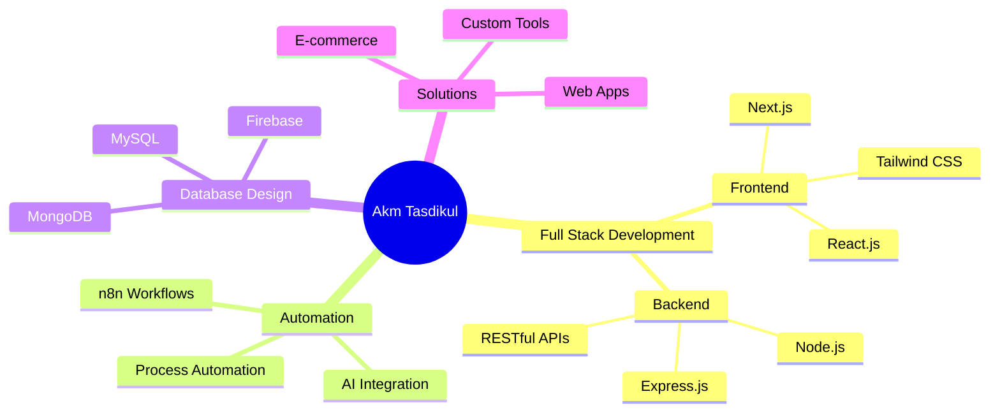

# Hi there! 

<div align="center">
  
</div>

<div align="center">
  
  [](your-linkedin-url)
  [](your-portfolio-url)
  [](mailto:your-email)
  [](your-upwork-url)
  
  
  
</div>

<br>

<div align="center">
  
</div>

---

## 🚀 About Me

```javascript
const akm = {
    name: "Akm Tasdikul Islam",
    role: "Full-Stack MERN Developer & AI Automation Expert",
    location: "Dhaka, Bangladesh 🇧🇩",
    education: "B.Sc. in CSE @ Bangladesh University of Professionals",
    workingOn: "Building scalable web applications & AI workflows",
    learning: ["Cloud Technologies", "Advanced Algorithms", "DevOps"],
    hobbies: ["Programming", "Problem Solving", "Building Cool Stuff"],
    funFact: "I turn coffee into code ☕ → 💻"
};
```

<div align="center">
  
### 💻 **"Code is poetry written in logic"**

</div>

---

## ⚡ Tech Stack

<div align="center">

### 🎨 Frontend Development


### ⚙️ Backend Development


### 🗄️ Database & Cloud


### 🤖 Automation & Tools


### 💻 Programming Languages


</div>

---

## 📊 GitHub Statistics

<div align="center">
  
  
</div>

<div align="center">
  
  
</div>

<div align="center">
  
</div>

---

## 🐍 Contribution Snake

<div align="center">
  
</div>

---

## 💼 What I Do

<div align="center">



</div>

---

## 🎯 Current Focus

<div align="center">

| 🔭 Currently Working On | 🌱 Learning | 💬 Ask Me About |
|:---:|:---:|:---:|
| Building AI-powered web apps | Cloud Technologies & DevOps | MERN Stack, n8n Automation |
| Scalable backend systems | Advanced algorithms | Full-Stack Development |
| Automation workflows | System Design | API Development & Integration |

</div>

---

## 🏆 Achievements

<div align="center">

```yaml
Education:
  - 🎓 B.Sc. in Computer Science & Engineering
  - 📚 GPA 5.00 in both SSC & HSC
  - 🏅 General Category Scholarship in SSC
  
Experience:
  - 💻 2+ years in Full-Stack Development
  - 🤖 n8n Automation Expert
  - 🌐 Built 10+ production-ready web applications
  
Skills:
  - ⚡ MERN Stack Specialist
  - 🔥 AI Workflow Integration
  - 🎨 Modern UI/UX Implementation
```

</div>

---

## 📈 Coding Activity

<div align="center">
  
<!--START_SECTION:waka-->
<!--END_SECTION:waka-->

</div>

---

## 🎨 Featured Projects

<div align="center">

<a href="https://github.com/YOUR_USERNAME/project1">
  
</a>

<a href="https://github.com/YOUR_USERNAME/project2">
  
</a>

</div>

---

## 💡 Random Dev Quote

<div align="center">
  


</div>

---

## 🎮 When I'm Not Coding

<div align="center">
  


**I'm constantly learning, building, and exploring new technologies!**

</div>

---

## 🤝 Let's Connect & Collaborate

<div align="center">
  
I'm always excited to work on innovative projects and collaborate with other developers!

### 📫 Reach me at:

[](your-linkedin-url)
[](mailto:your-email)
[](your-upwork-url)
[](your-portfolio-url)

</div>

---

<div align="center">
  
### ⭐ From [YOUR_USERNAME](https://github.com/YOUR_USERNAME) with 💙


</div>

---

<div align="center">
  


</div>
